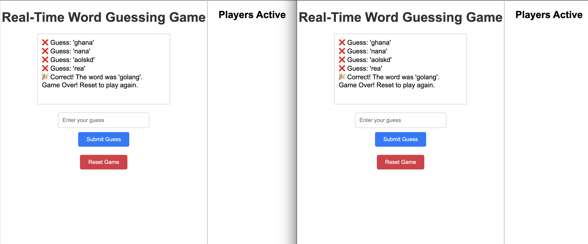

# **GuessStream**

Real-time multiplayer word guessing game built with **Go** and **Server-Sent Events (SSE)**.

---

## **Features**

- 🌐 Real-time updates for player guesses.
- 🕹️ Multiplayer support to play with friends.
- 🎉 Instant notifications for correct guesses and game status updates.
- 🔄 Simple reset functionality to start a new game.

---



## **Getting Started**

### Prerequisites

- **Go**: Ensure you have Go installed. You can download it from [golang.org](https://golang.org/dl/).
- **Git**: Ensure you have Git installed. You can download it from [git-scm.com](https://git-scm.com/).

### Installation

1. **Clone the repository**:

   ```sh
   git clone https://github.com/yourusername/guessstream.git
   cd guessstream
   ```

2. **Run the server**:

   ```sh
   go run main.go
   ```

   The server will start on `localhost:8080`.

3. **Open the game**:

   Open `index.html` in your browser to start playing.

Deployment Steps:

Build and test the image:

```
docker build -t word-game-frontend:latest .
docker run -p 8080:8080 word-game-frontend:latest

docker build -t word-game-backend:latest .
docker run -p 8080:8080 word-game-backend:latest
```

Push the Docker image to a container registry like Docker Hub, Amazon ECR, or GitHub Container Registry:

```
cd Frontend
   docker tag word-game-frontend:latest <your-dockerhub-username>/word-game-app:latest
   docker push <your-dockerhub-username>/word-game-frontend:latest

cd Backend
   docker tag word-game-backend:latest <your-dockerhub-username>/word-game-app:latest
   docker push <your-dockerhub-username>/word-game-backend:latest
```
